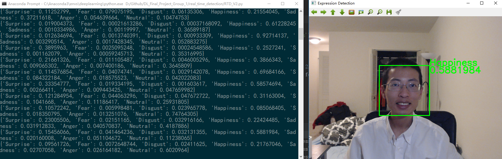

# Facial Expression Recognition
Final Project for Deep Learning @ GWU  
Dec. 2018

Authors: Xiaochi Li, Liwei Zhu, Jia Chen

## Data Source:
Real-world Affective Faces Database (RAF-DB): http://www.whdeng.cn/RAF/model1.html

## Usage (Training Neural Network):

**Enviroment requirement**:  Tensorflow 1.10.0, Keras 2.2.2

1. Unzip the data: `unzip /Code/RAFDB/aligned.zip`
2. Change main program to executable `chmod u+x /Code/Prototype/V2_main.py`
3. Execute main program `/Code/Prototype/V2_main.py` or `python3 /Code/Prototype/V2_main.py`  
For MLP: `python3 /Code/Prototype/MLP_main.py`
4. Type the name of your run in python console
5. Find the plot in `/Code/Prototype/imgs/`, the saved model in `/Code/Prototype/trained_model`, the tensorboard log in `/Code/Prototype/logs/`. For MLP: `/Code/Prototype/imgs_C/`, the saved model in `/Code/Prototype/trained_model_C`, the tensorboard log in `/Code/Prototype/logs_MLP/`

Place to modify:
In `/Code/Prototype/V2_main.py`: Line 20 `model = xxx` choose the model you want to see
In `/Code/Prototype/MLP_main.py`: Line 20 `model = xxx` choose the model you want to see

## Usage (Real time facial expression detection)

**Environment requirement**: opencv 3.4.3, Tensorflow 1.10.0, Keras 2.2.2

Execute main program `python3 Code/real_time_detection/RTD_V2.py`

Place to modify:
In `/Code/real_time_detection/RTD_helper.py` Line 24, 25 Choose the model you want to use
